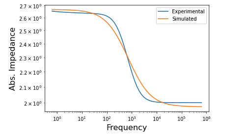

# Electrochemical Impedance Spectroscopy (EIS) Analysis

Electrochemical impedance spectroscopy (EIS) is an invaluable characterization techniques used for analyzing electrochemical behavior in batteries, fuel cells, and other electrochemical devices. EIS involves applying a small sinusoidal voltage to a system and observing the impedance of the system at various frequencies. This technique drives the system out of equilibrium so that kinetic features of the system can be studied. Furthermore, since the perturbations are small, the frequency analysis is much simpler to analyze (as opposed to large perturbations to the system).

## The Data

Although acquiring EIS data is fairly trivial, analyzing the data after the experiment is challenging. In particular, in order to understand what is occuring in the system, a model must be proposed and fit to the data. These models are composed of circuit components such as resistors, capacitors, and inductors. The models follow the same equations as electrical circuits such as Ohm's and Kirchhoff's law. EIS data is usually displayed in either a bode or nyquist plot. This tutorial will mainly focus on the bode plot, although all of the analysis done can be used for a nyquist plot. An example of experimental data, as well as simulated data is shown below. 

Figure 1: Bode plot of experimental and simulated data before curve fitting.

## Modeling and Fitting the Data

As discussed above, the models for EIS data are derived from circuit equations. The simples model that accurately describes the physics of the system is the one that should be picked when analyzing EIS data. In this particular case, a resistor that is in series with a another resistor and capacitor (the resistor and capacitor are in parallel with each other) is the chosen model. Figure 1 shows an example of the simulated data after guessing values for the two resistors and the single capacitor. The first resistor models the solution resistance in the system. The second resistor models the charge transfer resistance in the system. The capacitor models the double layer capacitance at the interface between the electrode and the solution. 

After defining the mathematical functions based on the defined circuit above, and leveraging curve_fit in the scipy library, the optimial values of the two resistors and single capacitor can be found. After finding the optimal values for these three parameters, the simulated data can be plotted again and compared against the experimental data. 

Figure 2: Bode plot of experimental and simulated data after curve fitting.

The simulated data with the circuit model accuratley predicts the experimental data much better now that the proper values for the three parameters have been shown. 

## Summary

EIS is an incredibly useful tool for analysis of electrochemical systems. However, this technique is only useful if a model can accurately describe what is occuring in the system. In this case, the scipy library, along with proper understanding of the physical system is used to properly fit simulated data to experimental data.