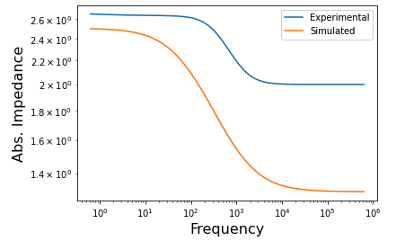

# Electrochemical Impedance Spectroscopy (EIS) Analysis

Electrochemical impedance spectroscopy (EIS) is an invaluable characterization techniques used for analyzing electrochemical behavior in batteries, fuel cells, and other electrochemical devices. EIS involves applying a small sinusoidal voltage to a system and observing the impedance of the system at various frequencies. This technique drives the system out of equilibrium so that kinetic features of the system can be studied. Furthermore, since the perturbations are small, the frequency analysis is much simpler to analyze (as opposed to large perturbations to the system).

## The Data

Although acquiring EIS data is fairly trivial, analyzing the data after the experiment is challenging. In particular, in order to understand what is occuring in the system, a model must be proposed and fit to the data. These models are composed of circuit components such as resistors, capacitors, and inductors. The models follow the same equations as electrical circuits such as Ohm's and Kirchhoff's law. EIS data is usually displayed in either a bode or nyquist plot. This tutorial will mainly focus on the bode plot, although all of the analysis done can be used for a nyquist plot. An example of experimental data, as well as simulated data is shown below.

Figure 1: Bode plot of experimental and simulated data before curve fitting.